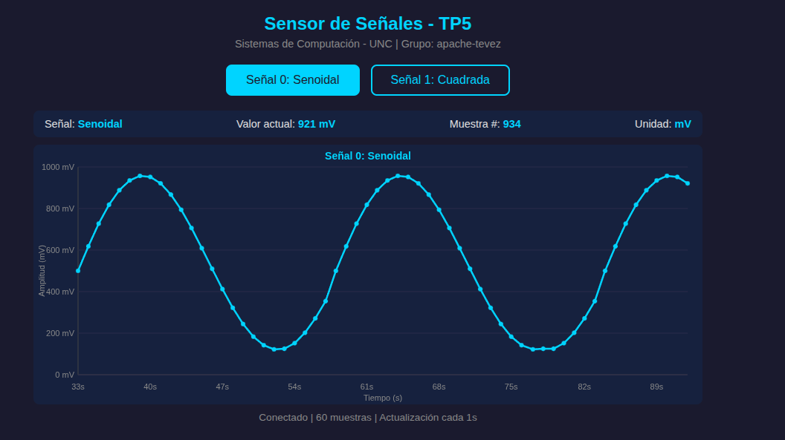
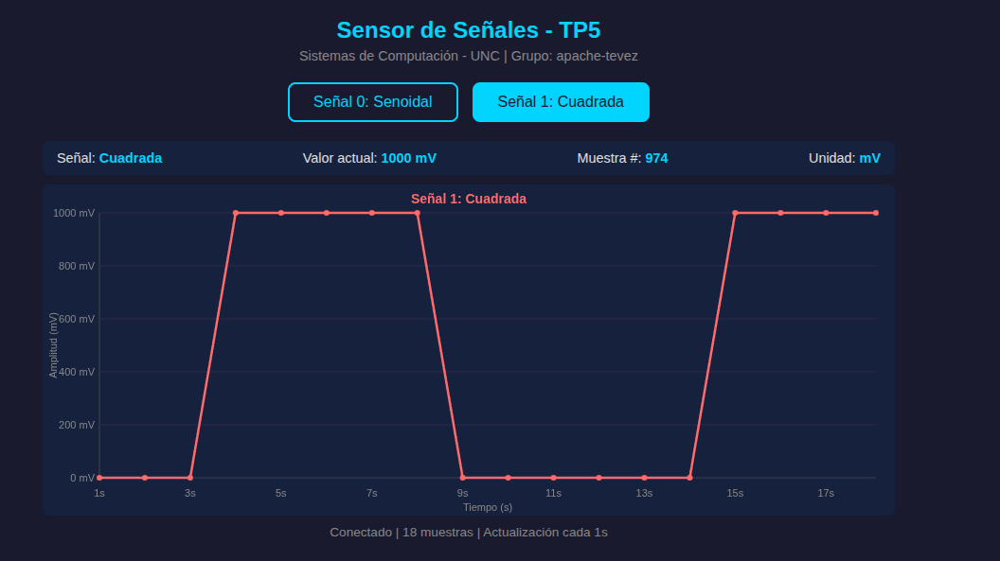
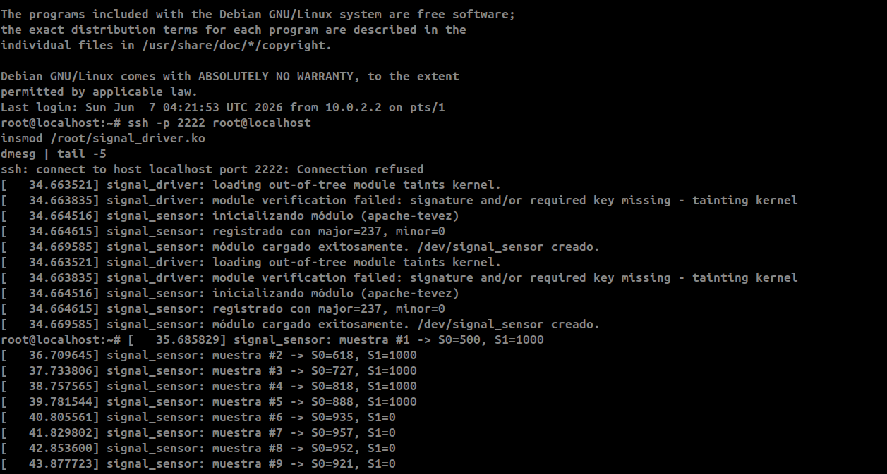

# TP5 — Character Device Driver para Sensado de Señales

### Grupo: Apache Tevez

### Profesores:

- Miguel Angel Solinas
- Javier Jorge

## Integrantes

| Nombre                            | Correo Electrónico                |
| --------------------------------- | --------------------------------- |
| Facundo Emanuel Avila Diaz Moreno | facundo.avila.027@mi.unc.edu.ar   |
| Candela Abigail Vergara           | candela.vergara@mi.unc.edu.ar     |
| Joaquín Alejandro Salinas         | joaquin.salinas.874@mi.unc.edu.ar |

---

## Introducción

En este trabajo práctico se diseñó y construyó un Character Device Driver (CDD) que permite sensar dos señales con un período de un segundo. A nivel de usuario, una aplicación lee una de las dos señales a través del archivo de dispositivo y la grafica en función del tiempo mediante una interfaz web. La aplicación también permite indicarle al CDD cuál de las dos señales leer, y cuando se cambia de señal el gráfico se resetea y se acomoda a la nueva medición.

El enfoque utilizado es el de compilación cruzada (cross-compilation): todo el código se escribe y compila en la PC anfitriona (host x86_64) apuntando a la arquitectura del target (ARM64), y los binarios resultantes se transfieren vía SSH a una máquina virtual QEMU que emula un sistema ARM.

---

## Marco teórico

### ¿Qué es un driver?

Un driver es un software que permite al sistema operativo interactuar con un periférico, creando una abstracción del hardware y proporcionando una interfaz para utilizarlo. Como se vio en clase, un driver tiene dos partes: una específica del dispositivo (que conoce el protocolo de comunicación con el hardware) y otra específica del sistema operativo (que expone la interfaz estandarizada al espacio de usuario).

Habitualmente son los fabricantes del hardware quienes escriben sus drivers, ya que conocen mejor el funcionamiento interno de cada dispositivo. Sin embargo, en el ecosistema Linux existen muchos controladores libres escritos por desarrolladores independientes, a veces con cooperación del fabricante y a veces mediante ingeniería inversa.

### Clasificación de drivers en Linux

En Linux, los drivers se clasifican en tres verticales según la interfaz que ofrecen al sistema operativo. Los drivers orientados a paquetes (vertical "Network") manejan interfaces de red. Los orientados a bloques (vertical "Storage") manejan dispositivos de almacenamiento como discos. Y los orientados a bytes (vertical "Character") manejan dispositivos que se comunican byte a byte, como puertos seriales, controladores de audio, controladores de video y controladores de cámara. Esta última categoría, los Character Device Drivers o CDD, constituye el grupo mayoritario de drivers y es el foco de este trabajo.

### El modelo de capas de un CDD

Un CDD opera dentro de un modelo de cuatro capas: Application, Character Device File (CDF), Character Device Driver (CDD) y Character Device. El vínculo entre la aplicación y el CDF se basa en el nombre del archivo del dispositivo (por ejemplo `/dev/signal_sensor`). Pero el vínculo entre el CDF y el CDD se basa en el par de números `<major, minor>` del archivo de dispositivo, no en su nombre.

El número major identifica al controlador (driver) asociado, mientras que el minor distingue entre dispositivos individuales gestionados por ese mismo controlador. Estos números se pueden asignar estáticamente con `register_chrdev_region()` o dinámicamente con `alloc_chrdev_region()`, siendo esta última la opción preferida porque evita conflictos con otros drivers.

### Creación automática del CDF

A partir del kernel 2.6, la creación de los archivos de dispositivo en `/dev` dejó de ser responsabilidad exclusiva del kernel. El kernel completa la información de clase del dispositivo en `/sys/class/`, y el demonio `udev` del espacio de usuario interpreta esa información y crea el archivo correspondiente en `/dev`. En nuestro driver usamos `class_create()` para crear la clase y `device_create()` para registrar el dispositivo, lo que permite que udev (cuando está activo) genere automáticamente `/dev/signal_sensor`.

### File Operations

La estructura `file_operations` define las funciones que implementa el driver para responder a las syscalls del espacio de usuario. Las operaciones fundamentales son `open()`, `release()`, `read()` y `write()`. Los valores de retorno de `read()` y `write()` son de tipo `ssize_t`: un valor positivo indica la cantidad de bytes transferidos, y un valor negativo indica un error. La función `read()` debe usar `copy_to_user()` para transferir datos del kernel space al user space de forma segura, y `write()` debe usar `copy_from_user()` para la dirección inversa.

### Device Tree y descubrimiento de hardware

Como se vio en el documento sobre Kernel Device Tree, existen buses de hardware descubribles (como PCI y USB, que permiten detectar dispositivos en tiempo de ejecución) y buses no descubribles (como I2C, SPI y buses mapeados en memoria). Para estos últimos, el Device Tree proporciona un método independiente del sistema operativo para describir la topología del hardware al kernel, indicando qué dispositivos existen, en qué direcciones están mapeados, qué interrupciones usan y cómo están conectados.

En nuestro caso, al trabajar con una VM genérica (QEMU `virt`) en vez de hardware real como una Raspberry Pi, no necesitamos un Device Tree personalizado: las señales se simulan por software dentro del módulo de kernel.

---

## Desarrollo práctico

### Entorno de trabajo

Se configuró una máquina virtual ARM64 usando QEMU con la máquina `virt`, que es la más estable y utilizada en la industria para desarrollo embebido ARM. Se eligió esta opción en lugar de la emulación `raspi3b` después de encontrar incompatibilidades con QEMU 8.2 en Ubuntu Noble, incluyendo problemas con el flag `-curses`, errores de USB networking y boot colgado.

La VM corre Debian 12 (Bookworm) con kernel 6.1.0-49-arm64, y se accede desde el host por SSH en el puerto 2222 y por HTTP en el puerto 8080 para la visualización web.

El comando para levantar la VM es:

```bash
qemu-system-aarch64 \
    -machine virt -cpu cortex-a72 -m 1024 -nographic \
    -bios /usr/share/AAVMF/AAVMF_CODE.fd \
    -drive file=debian-12-nocloud-arm64.qcow2,if=virtio,format=qcow2 \
    -netdev user,id=net0,hostfwd=tcp::2222-:22,hostfwd=tcp::8080-:8080 \
    -device virtio-net-pci,netdev=net0
```

### El Character Device Driver

El driver `signal_driver.c` implementa un CDD completo que sensa dos señales simuladas con período de 1 segundo. El módulo se estructura siguiendo la progresión drv1 → drv2 → drv3 → drv4 vista en clase.

El constructor del módulo (`signal_driver_init`) realiza cinco pasos en orden: registra el rango `<major, minor>` dinámicamente con `alloc_chrdev_region()`, inicializa la estructura `cdev` con las file operations, crea la clase del dispositivo en `/sys/class/sdec/`, crea el dispositivo `/dev/signal_sensor`, e inicia un timer del kernel configurado para dispararse cada 1000ms.

El destructor (`signal_driver_exit`) libera todos los recursos en orden cronológicamente inverso, como indica la buena práctica del kernel: primero detiene el timer con `del_timer_sync()`, luego destruye el dispositivo, la clase, elimina el cdev y finalmente libera la región de caracteres.

El timer de muestreo genera dos señales: la señal 0 es una onda senoidal implementada mediante una tabla de 25 valores precalculados de sin(x) mapeados al rango [0, 1000], y la señal 1 es una onda cuadrada que alterna entre 0 y 1000 cada 5 muestras. Se utiliza un mutex para proteger el acceso concurrente a las variables compartidas entre el timer y las file operations.

La operación `read()` devuelve el valor de la señal seleccionada en formato texto `SIGNAL=<n>,VALUE=<valor>,SAMPLE=<idx>`, permitiendo que la aplicación de usuario parsee fácilmente los datos. La operación `write()` acepta los caracteres "0" o "1" para seleccionar qué señal leer.

### Compilación y carga del módulo

Para compilar dentro de la VM (compilación nativa):

```bash
make NATIVE_ARM=1
```

Para cargar el módulo:

```bash
insmod signal_driver.ko
```

La verificación con `dmesg` muestra:

```
signal_sensor: inicializando módulo (apache-tevez)
signal_sensor: registrado con major=237, minor=0
signal_sensor: módulo cargado exitosamente. /dev/signal_sensor creado.
```

Y la prueba funcional:

```bash
$ cat /dev/signal_sensor
SIGNAL=0,VALUE=142,SAMPLE=94

$ echo "1" > /dev/signal_sensor
$ cat /dev/signal_sensor
SIGNAL=1,VALUE=0,SAMPLE=96
```

Como la VM Debian no tiene udev activo por defecto, el nodo del dispositivo se crea manualmente con `mknod /dev/signal_sensor c 237 0`.

### Cross-compilation

En la PC host (Ubuntu 24.04, x86_64) se instaló el cross-compiler `gcc-aarch64-linux-gnu` y se copiaron los kernel headers desde la VM vía SCP. El Makefile soporta compilación cruzada con el flag `CROSS=1`:

```bash
export QEMU_LD_PREFIX=/usr/aarch64-linux-gnu
make CROSS=1
```

El Makefile configura automáticamente `ARCH=arm64`, `CROSS_COMPILE=aarch64-linux-gnu-` y apunta `KDIR` a los kernel headers copiados. La variable `QEMU_LD_PREFIX` es necesaria porque los scripts auxiliares del build system del kernel (como `fixdep`) son binarios ARM64 que se ejecutan en el host x86 mediante `qemu-user-static`.

Una vez compilado, el módulo se transfiere a la VM con `scp`:

```bash
make deploy   # equivalente a: scp -P 2222 signal_driver.ko root@localhost:/root/
```

Se verificó con `file signal_driver.ko` que el binario resultante es efectivamente un objeto ELF para ARM aarch64.

### Aplicación de usuario

La aplicación `signal_app.py` cumple tres funciones: leer el dispositivo de caracteres, servir los datos por red y presentar una interfaz de visualización web.

Un hilo dedicado abre `/dev/signal_sensor` cada segundo y parsea la respuesta del driver, almacenando las últimas 60 muestras en un buffer circular. Un servidor HTTP en el puerto 8080 expone la página web principal en `/`, una API REST en `/api/data` que devuelve las muestras en formato JSON, y un endpoint `/api/signal` que acepta POST para cambiar la señal activa (escribiendo al CDD).

La interfaz web está embebida en el mismo archivo Python como un string HTML. Usa Canvas 2D de JavaScript para dibujar el gráfico en tiempo real, actualizándose cada segundo mediante `fetch()`. El gráfico muestra amplitud en mV en el eje Y y tiempo en segundos en el eje X, indicando claramente qué tipo de señal se está sensando. Cuando el usuario cambia de señal presionando un botón, el gráfico se resetea automáticamente y comienza a acumular muestras de la nueva señal.


## Conclusiones

En este trabajo se abordó el proceso completo de construcción de un Character Device Driver, desde el registro del dispositivo de caracteres hasta la interfaz de usuario final. Se implementaron las file operations (`open`, `release`, `read`, `write`) que permiten al espacio de usuario interactuar con el módulo de kernel a través del archivo `/dev/signal_sensor`, siguiendo el modelo de capas CDF → CDD presentado en clase.

El uso de compilación cruzada demostró el flujo de trabajo estándar en desarrollo embebido: desarrollar en un host potente y desplegar en un target con arquitectura diferente. La elección de QEMU con máquina `virt` como alternativa a hardware real permitió completar todo el ciclo de desarrollo sin necesidad de una Raspberry Pi física, manteniendo el mismo flujo de cross-compilation, transferencia SSH y carga dinámica de módulos.

El sistema completo integra conceptos de múltiples temas de la materia: módulos de kernel (TP4), espacio de usuario vs kernel space, transferencia segura de datos con `copy_to_user`/`copy_from_user`, registro de dispositivos de caracteres con `<major, minor>`, y la relación entre `/sys`, `/dev` y `udev` para la creación automática de archivos de dispositivo.

### Evidencia


*Figura 1: Gráfico en tiempo real de la señal senoidal (Señal 0)*


*Figura 2: Gráfico en tiempo real de la señal cuadrada (Señal 1)*


*Figura 3: Salida de dmesg mostrando el módulo cargado*

